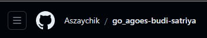
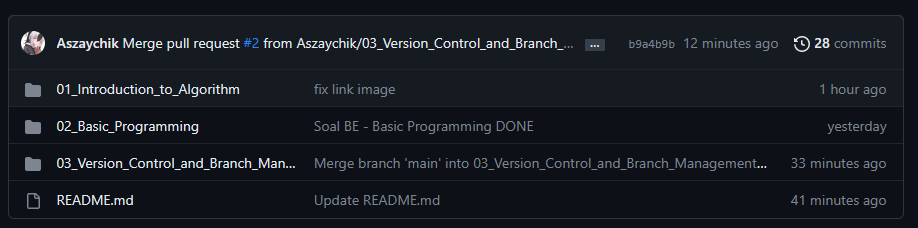
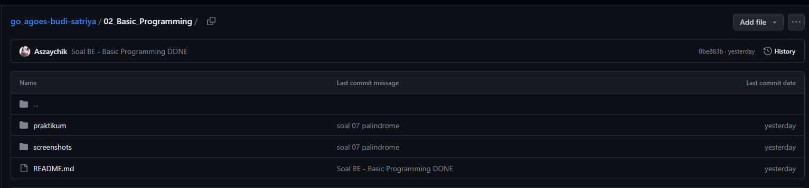
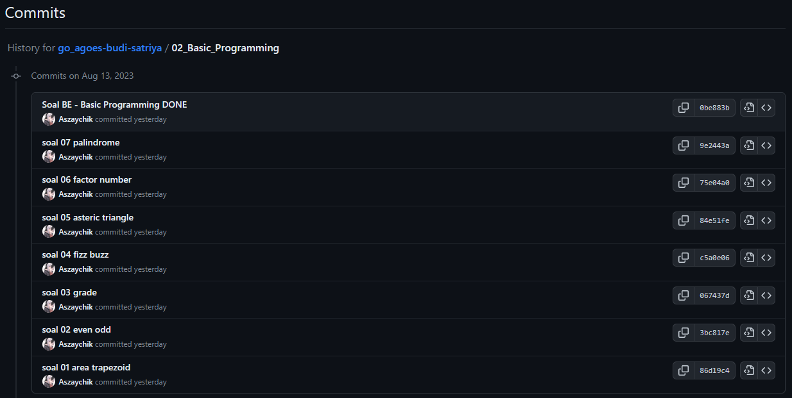
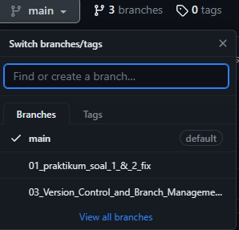
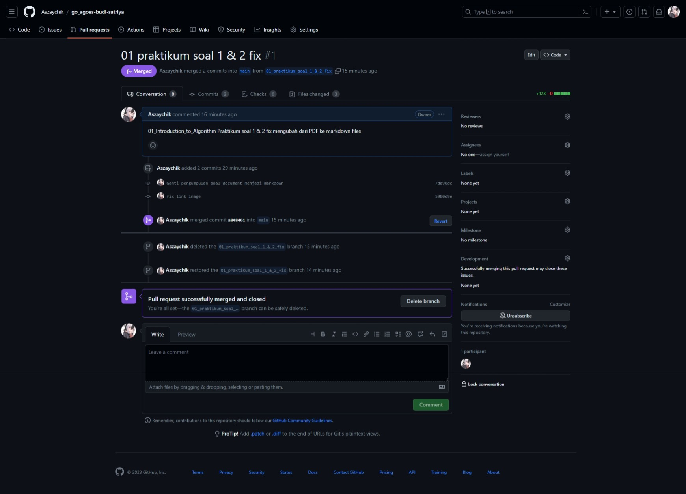

# Latihan Version Control and Branch Management (Git)

## Soal Prioritas 1

### 1. Repo Github dan Nama

### 2. Folder dan Commit

#### Main Folders

#### Sub Folders

#### Commit

## Soal Prioritas 2

### 1. Branch

### 2. Pull Request

