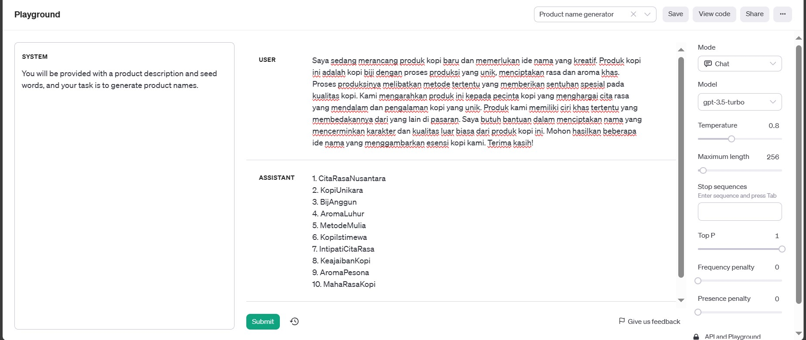

# Introduction to Artificial Intelligence

## Pengenalan AI

Kecerdasan Buatan (AI) adalah disiplin ilmu komputer yang bertujuan mengembangkan sistem yang mampu menjalankan tugas tanpa intervensi manusia. AI mencakup berbagai teknik, seperti machine learning dan pengolahan bahasa alami, yang memungkinkan komputer belajar dari data dan pengalaman.

## Definisi AI

Definisi AI mencakup penggunaan algoritma dan model matematika untuk memungkinkan komputer memahami data, belajar dari pengalaman, dan mengeksekusi tugas cerdas. Pembelajaran mesin, jaringan saraf, dan deep learning adalah konsep-konsep utama yang mendorong kemajuan dalam bidang ini.

## Teknologi Penggerak AI

AI didorong oleh teknologi seperti machine learning, yang memungkinkan komputer belajar pola dari data. Neural networks, terutama deep neural networks, digunakan untuk mengenali pola yang kompleks. Algoritma cerdas seperti reinforcement learning juga menjadi bagian integral dari teknologi penggerak AI.

## Penggunaan AI dalam Software Development

Dalam pengembangan perangkat lunak, AI digunakan untuk otomatisasi tugas pengkodean rutin, pengoptimalan algoritma, dan bahkan pengujian otomatis. Penggunaan AI dapat mempercepat siklus pengembangan dan meningkatkan kualitas perangkat lunak.

## Etika dan Pengaruh AI

Pertimbangan etika menjadi semakin penting seiring dengan perkembangan AI. Keamanan data, transparansi algoritma, dan dampak sosial dari keputusan AI adalah aspek-aspek yang harus diperhatikan. Keputusan yang dihasilkan oleh sistem AI harus selaras dengan nilai dan etika manusia.

## Contoh Penggunaan OpenAI

OpenAI telah berkontribusi signifikan dalam penelitian AI, mengembangkan model-model canggih seperti GPT (Generative Pre-trained Transformer). Contoh penerapan OpenAI mencakup penulisan teks otomatis, penerjemahan bahasa, dan bahkan seni berbasis AI. Kontribusi OpenAI memainkan peran penting dalam menggambarkan potensi dan tantangan dalam penerapan teknologi AI di berbagai bidang.

