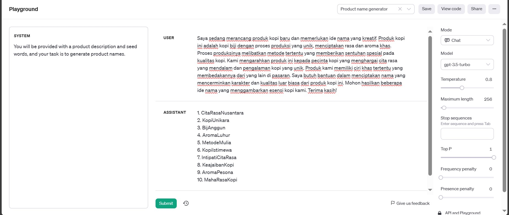

# Introduction to Artificial Intelligence

## Playground Examples

> ### Product Name Generator

- #### Input

```
Saya sedang merancang produk kopi baru dan memerlukan ide nama yang kreatif.
Produk kopi ini adalah kopi biji dengan proses produksi yang unik, menciptakan rasa dan aroma khas.
Proses produksinya melibatkan metode tertentu yang memberikan sentuhan spesial pada kualitas kopi.
Kami mengarahkan produk ini kepada pecinta kopi yang menghargai cita rasa yang mendalam dan pengalaman kopi yang unik.
Produk kami memiliki ciri khas tertentu yang membedakannya dari yang lain di pasaran.
Saya butuh bantuan dalam menciptakan nama yang mencerminkan karakter dan kualitas luar biasa dari produk kopi ini.
Mohon hasilkan beberapa ide nama yang menggambarkan esensi kopi kami.
Terima kasih!
```

- #### Ouput

```
1. CitaRasaNusantara
2. KopiUnikara
3. BijAnggun
4. AromaLuhur
5. MetodeMulia
6. KopiIstimewa
7. IntipatiCitaRasa
8. KeajaibanKopi
9. AromaPesona
10. MahaRasaKopi
```

- #### Screenshots


